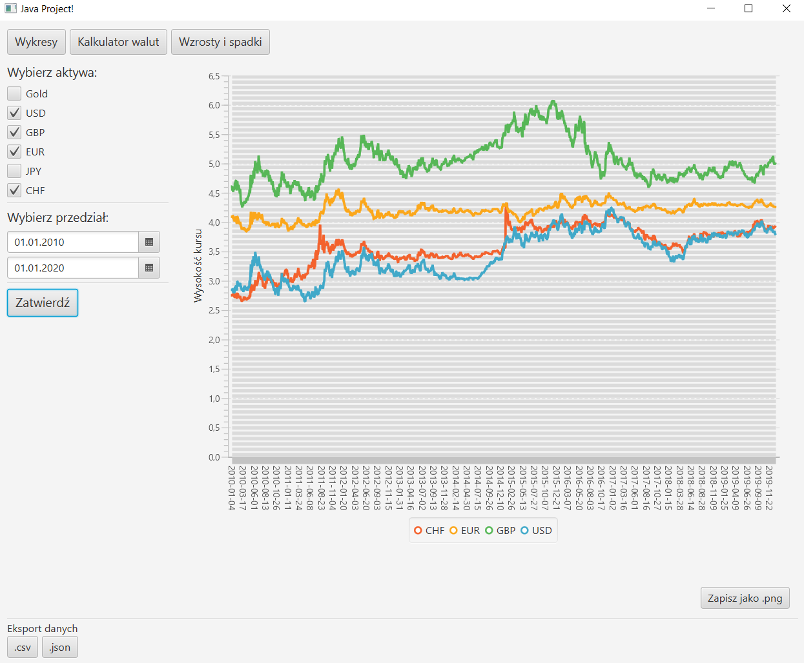
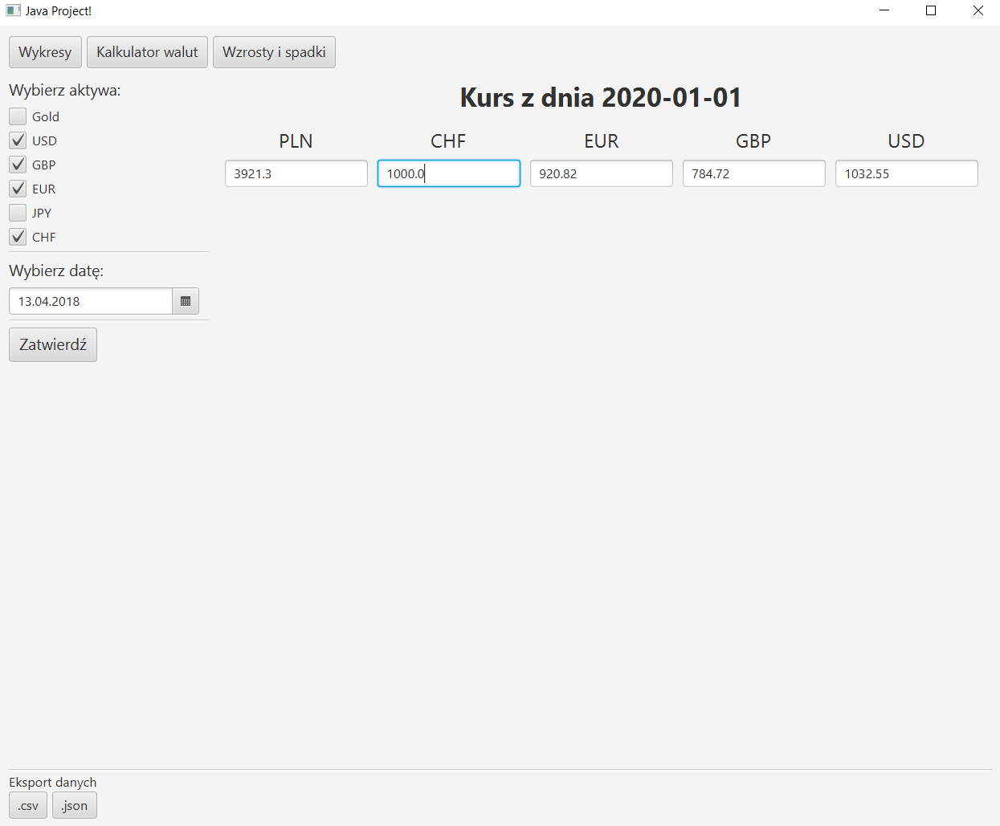
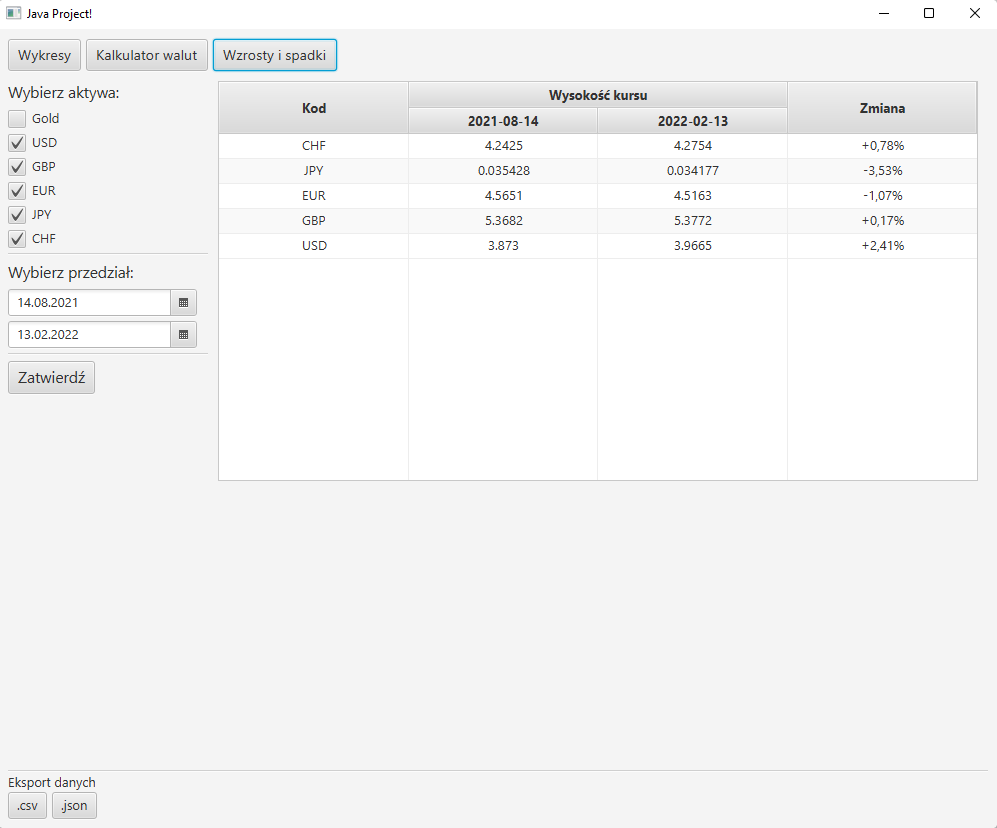

## Screenshots

## Info

`mvn javafx:run`

### ToDo
* aplikacja okienkowa ✔
* pobieranie kursów walut i złota ✔
* pobranie danych w odniesieniu do ustawionych parametrów ✔
* Konwersja danych JSON albo XML (w zależności od wyboru formatu na który pozwoli nam dana strona) na klasy Java ✔
* wybranie okresu porównawczego ✔
* obliczenie wzrostu, spadku dla wybranego okresu ✔
* nałożenie kilku wykresów kursów walut na siebie ✔
* eksport danych w wybranym formacie (.csv) ✔
* eksport wykresów w wybranym formacie zdjęciowym ✔
* kalkulator walut ✔