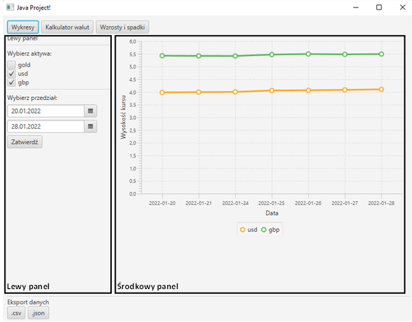

## Informacje
*****


Rozróżniamy:
* górny pasek menu do przełączania widoków
* lewy panel, gdzie użytkownik wprowadza dane, nie zmienia się przy zmianie widoku
* środkowy panel, na którym jest przełączany widok

Aplikacja jest oparta o pliki `.fxml`, którym odpowiadają odpowiednie klasy `Controller`.
Główny plik to `app.fxml` ładowany przy starcie aplikacji, kontrolowany przez `AppController`.

Pozostałe widoki wyświetlane na środkowym panelu to:
* `chartView` - do wyświetlania wykresów
* `calculatorView` - do wyświelania kalkulatora walut
* `trendsView` - do wyświetlania trendów, czyli o ile procent kurs wybranych aktywów zmienieł się w danym okresie

Kontroler każdego z tych widoków dziedzieczy po klasie `ViewController`.

### Dane od użytkownika
Użytkownik wprowadza dane w lewym panelu. Po kliknięciu przycisku *Zatwierdź* dane są zbierane do instancji klasy `UserInput`. Wyglądają one na przykład tak:
```
UserInput{startDate=2022-02-02, endDate=2022-02-04, currencyCodes=[usd, gbp]}
```
Następnie przekazywane są do statycznej klasy `DataHolder`, który pobiera za pomącą `NbpParser` dane z serwisu nbp oraz je trzyma. 

Przy zmianie widoku / wprowadzeniu nowych danych wywoływana jest metoda `UpdateView` na aktualnym kontrolerze widoku, który sobie dane pobiera od data holdera i się aktualizuje.
