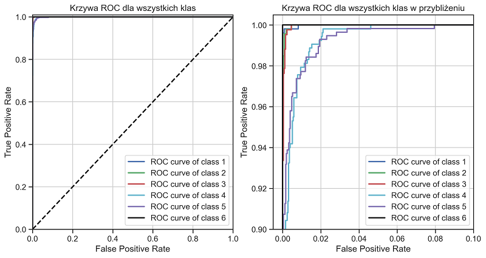

We've got 561 features - sensor signals. The goal was to predict one of six classes - WALKING, WALKING_UPSTAIRS, WALKING_DOWNSTAIRS, SITTING, STANDING, LAYING. The main problem was to distinguish between SITTING AND STANDING. Despite that, we achieved nearly 99% of accuracy.

The project consists of three milestones (jupyter notebooks).