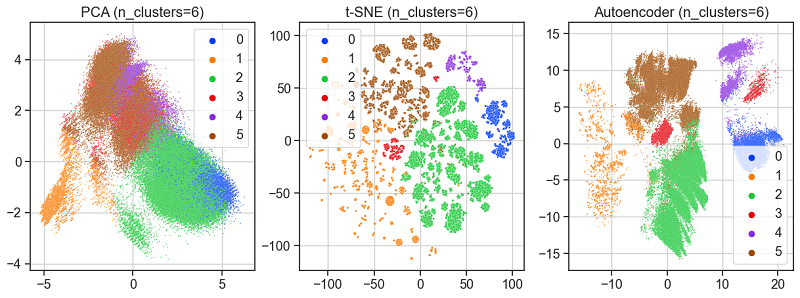
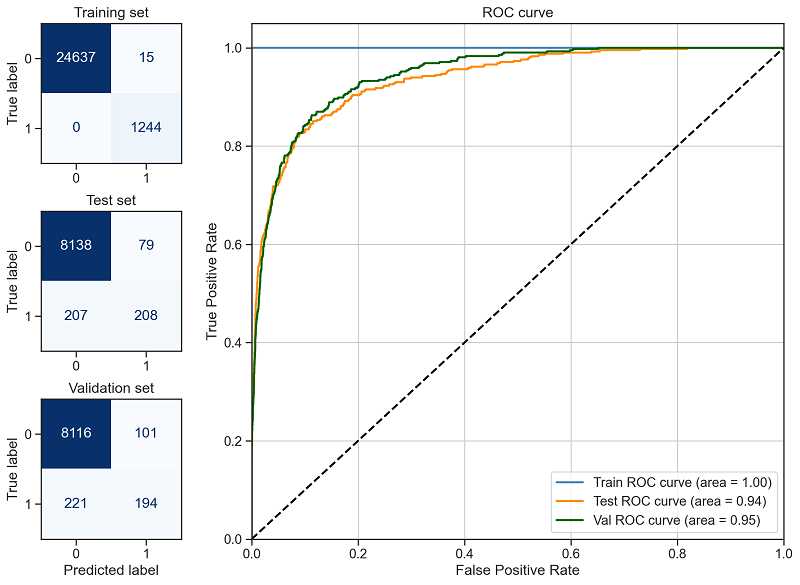
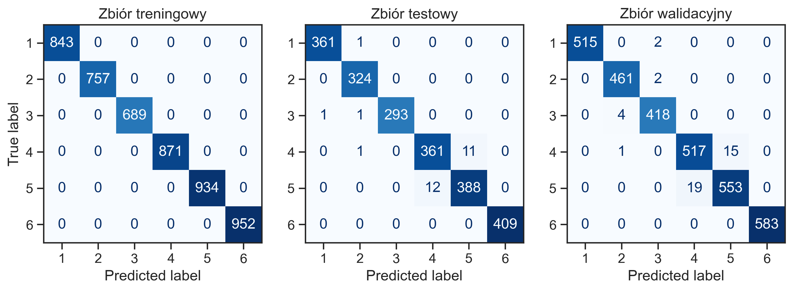
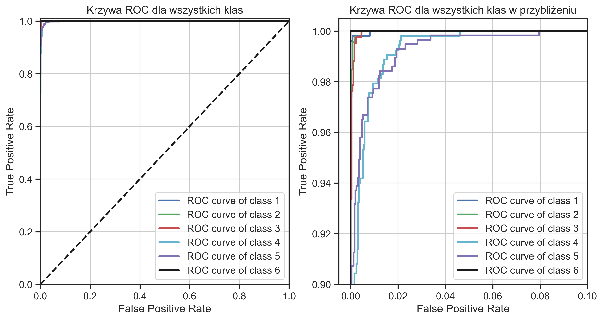
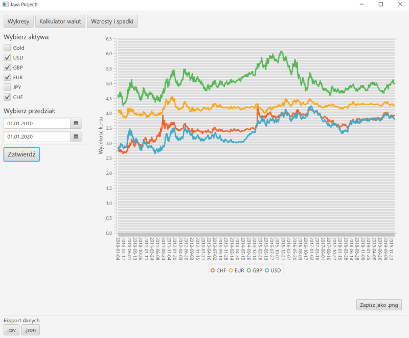
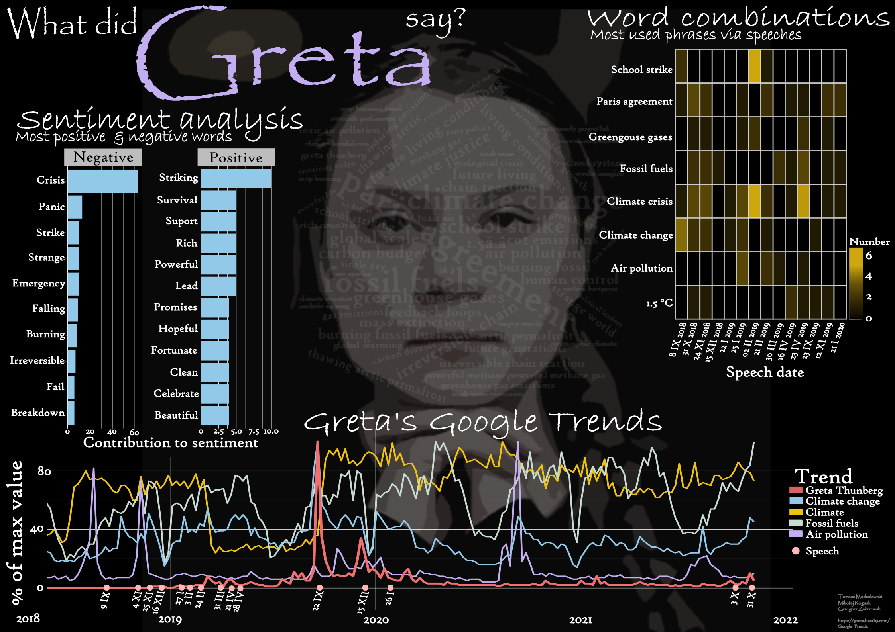

# my-projects
This repo contains some of my university projects.

## Feature selection methods benchmark

[Feature selection methods benchmark](FeatureSelectionBenchmark) - mutual information (JMI & CMIM), random forest feature importance, sequential feature selection
* [presentation](FeatureSelectionBenchmark/ZakGrz_presentation.pdf)
* [report](FeatureSelectionBenchmark/ZakGrz_report.pdf)

## Clustering US Census

[Machine learning project](ClusteringUSCensus/README.md) - clustering US Census (1990) data set

## Polish companies bankruptcy

[Machine learning project](BankruptcyPrediction/README.md) - bankruptcy prediction of Polish companies

## Predicting human activity 

[Machine learning project](PredictingHumanActivity/README.md) - predicting human activity based on smartphone movement measurements. 

## Java GUI app

[Application](JavaApp/README.md) that shows currency exchange rates and gold prices published by Polish National Bank. Done with Java & JavaFx.

## Shiny App with Youtube data analysis   
[R Shiny app](ShinyYoutubeApp/README.md) with YouTube user-data analysis and visualizations.
Maybe it still works [here](https://zakrzewow.shinyapps.io/twd2/).

## Poster about climate change and environmental protection
[Analysis](PosterAboutClimate/README.md) of Greta Thunberg's speeches and her influence on the interest in climate. Data analysis and visualization in R language with ggplot2 and other tidyverse packages. Poster created in Inkscape.

## Stack Exchange Data Analysis
[Very brief](StackExchangeDataAnalysis/README.md) look at some Stack Exchange Forums. With R, pandas and R Markdown.

---
Done in collaboration with my colleagues. Projects are added after being finished.
